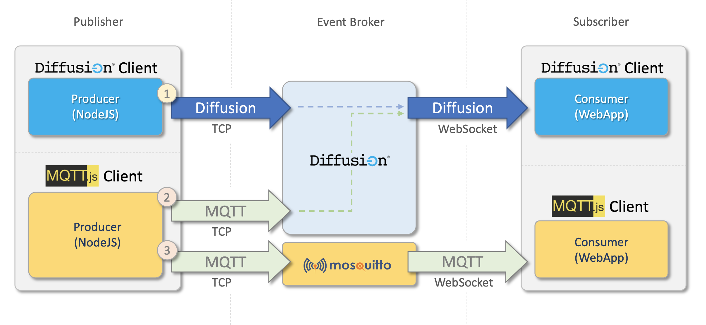

# Diffusion's MQTT Connector 

In this tutorial we are going to go through how to create a **producer** and a **consumer**, using Javascript.

Since it's hard to find anyone who hasn't fallen under the charm of the unique **StarWars** motion pictures, I think it would be a nice treat to go over some of the most iconic episode dialogues (**Episode IV**), and use them to play a bit, and in the meantime, learn how Diffusion integrates MQTT as a Connector, in an efficient and really fast way. It'd be like messages would be *warping* from producer to consumers.

# Requirements

1. Since Diffusion's MQTT connector, at the time this document was written, is only supported in the on-premise Diffusion version, we need to install it in our own infrastructure. You can get it in our  [downloads page](https://www.pushtechnology.com/developers/releases/6.6/)

2. The Dialogue Producer will be built as a nodejs command line application, so we'll need to have nodejs installed.
3. In this github repository, we are including Episode IV dialogues. Dialogues have been downloaded from [Kaggle](https://www.kaggle.com/xvivancos/star-wars-movie-scripts?select=SW_EpisodeIV.txt)
4. To connect to MQTT servers and Diffusion's MQTT Connector, we are using an MQTT client library: [Mqtt.js](https://github.com/mqttjs/MQTT.js)

# What we'll do

## We'll be building a producer, which:

1. Will have the abillity to connect either to an MQTT Server (we'll be using [Mosquitto](https://test.mosquitto.org/)), or to Diffusion through its MQTT Connector.
2. Will read the dialogues file, and send them to the server, every one second.

## A Consumer Web App, which:

1. Will have the abillity to connect either to MQTT server or to Diffusion's through its MQTT Connector.
2. Consume messages produced by the Producer app.
3. Show them in the console.
4. Show them in a fun way. (*Have you ever seen the Startwars initial scroll at the begining of each movie?*)



In the above diagram, the different data flows are depicted:

1. It's a pure MQTT data flow, through an MQTT broker.
2. It's an MQTT data flow, through Diffusion's MQTT Connector
3. It's a pure Diffusion flow.

The consumer, can connect to the stream, via any of the different protocols.

So let's strech our legs, grab a cup of coffee or you preferred beverage, and let's get started.

# Diffusion on-premise

Make sure you follow instructions in our download page, about how to install Diffusion on-premise server. After it's installed we need to enable the protocols we are going to use. We'll use TCP from the Producer, and WebSockets from the Web Application.
To enable protocols: 
1. Go to: {diffusion_install_dir}/etc/Connectors.xml.
2. Look for the protocols tag `<protocols>`. It should be commented out, by default. 
3. Uncomment the tag, and the protocos we want to enable. We'll need to enable 3 out of the 4 protocols, listed in there:
    1. DIFUSSION_WEBSOCKET: This protocol will be used when we connect from the Consumer Web App, using Diffusion.
    2. MQTT_TCP: This protocol will be used when we connect from the Producer App, via MQTT
    3. MQTT_WEBSOCKET: This protocol will be used when we connect from the Consumer Web App, either by MQTT or Diffusion MQTT Connector.
Example:
```xml
    <!--  Uncomment to enable or disable specific protocols. -->
        <protocols>
            <protocol>DIFFUSION_WEBSOCKET</protocol>
            <!-- <protocol>DIFFUSION_HTTP_LONG_POLL</protocol> -->
            <protocol>MQTT_TCP</protocol>
            <protocol>MQTT_WEBSOCKET</protocol>
        </protocols>

```
4. It's important to notice that when connecting to Diffusion's MQTT Connector, via WebSockets, the url must include **diffusion** as path. We'll see it better when we discuss the Consumer in detail.

# The Producer

The producer is a nodejs application that we'll run using the command line.
## Connecting to the server:

Since it is a nodejs application we are going to connect using TCP.
In the main script [dialogue-generator.js](https://github.com/diffusion-playground/starwars-mqtt/blob/master/javascript/producer/dialogue-generator.js), we instantiate the client

```javascript
    constructor() {
        console.log('Starting dialogue producer...');                     
        // Let's create a client to the server. This could be an MQTT server or Diffusion
        this.client = new Mosquitto('StarWars', this.onServerConnected);
        this.connectToServer();
    }        
    connectToServer = () => {
        // We get Server type from the command line, using this.getServerType()
        if (this.getServerType() === 'difussion') {
            // This url, points to our on-premise Diffusion broker
            this.client.connect('tcp://localhost:8086', {
                protocolVersion: 5, // Diffusion supports version 5 of MQTT
                // These are the on-premise server credentials.
                username: 'admin', 
                password: 'password'
            });
            return;
        }
        // If we didn't request to connect to Diffusion server, 
        // the client will try to connect to Mosquitto's server.
        this.client.connect('tcp://test.mosquitto.org');
    }
```    

The connect function lies in the [Mosquitto.js](https://github.com/diffusion-playground/starwars-mqtt/blob/master/javascript/producer/mqtt-clients/Mosquitto.js) client

```javascript
    connect = (serverUrl, params = null) => {        
        // If we get Params, it means we are trying to connect to Diffusion
        if (params) {
            this.client = mqtt.connect(serverUrl, params);    
        // Otherwise, let's try to connect to Mosquitto
        } else {
            this.client = mqtt.connect(serverUrl);
        }
        // After connecting, we set callbacks to handle different events
        this.client.on('error', this.onConnectError);
        this.client.on('connect', this.onConnect);        
        this.client.on('message', this.onReceivedDialogue);
    }
```

# The Consumer
## Connecting to an MQTT Server
## Connecting to Diffusion, using the MQTT Connector
# Diffusion Console

# Conclusion


