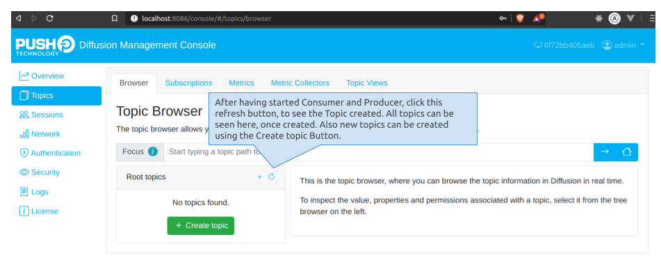
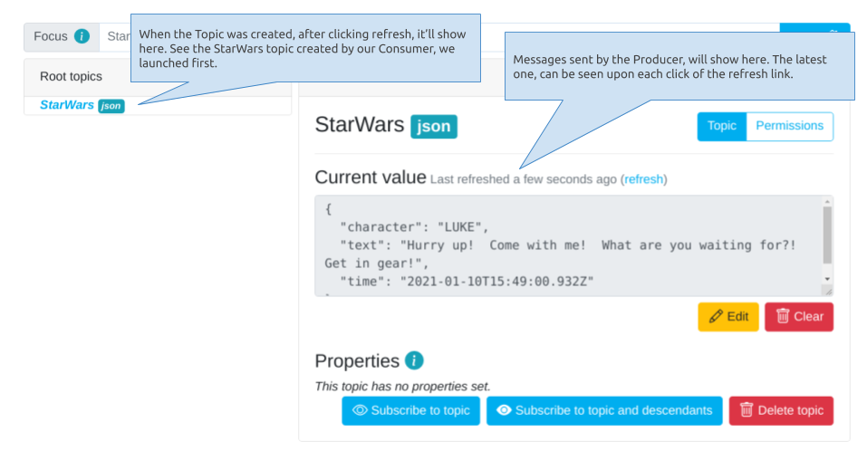
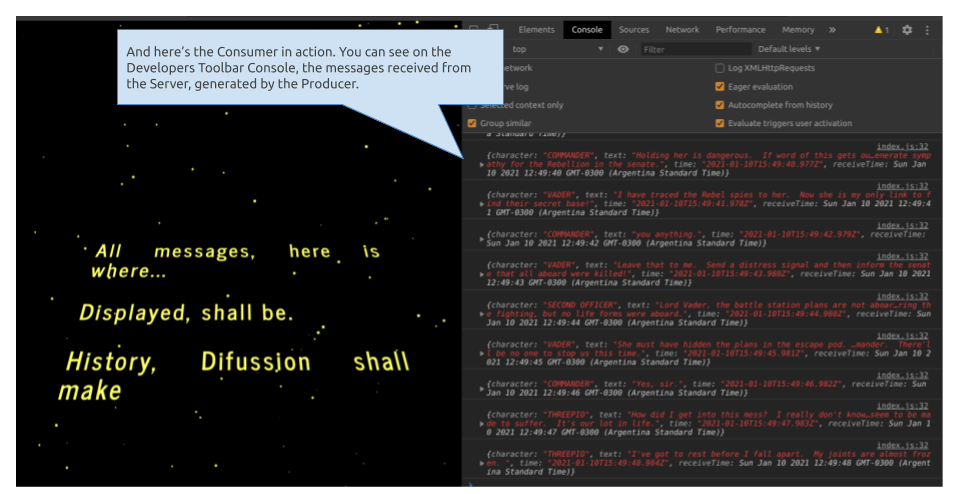
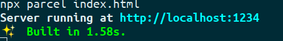
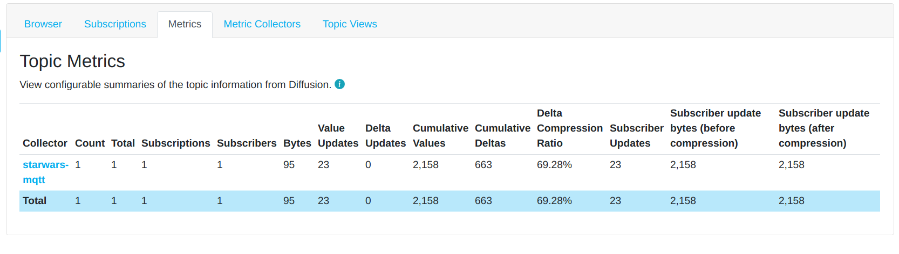
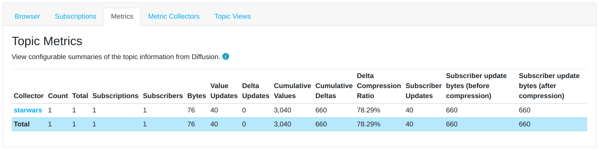

# Diffusion's MQTT Connector 

In this tutorial we are going to go through how to create a **Producer** and a **Consumer**, using Javascript.

Since it's hard to find anyone who hasn't fallen under the charm of the unique **StarWars** motion pictures, I think it would be a nice treat to go over some of the most iconic episode dialogues (**Episode IV**), and use them to play a bit, and in the meantime, learn how Diffusion integrates MQTT as a Connector, in an efficient and really fast way. It'd be like messages would be *hyperdriving* from Producer to Consumers.

# Requirements

1. Since Diffusion's MQTT connector, at the time this document was written, is only supported in the on-premise Diffusion version, we need to install it in our own infrastructure. You can get it in our  [downloads page](https://www.pushtechnology.com/developers/releases/6.6/)

2. The Dialogue Producer will be built as a nodejs command line application, so we'll need to have nodejs installed.
3. In this github repository, we are including Episode IV dialogues. Dialogues have been downloaded from [Kaggle](https://www.kaggle.com/xvivancos/star-wars-movie-scripts?select=SW_EpisodeIV.txt)
    1. "Note: Only use this example Kaggle StartWars datasets under this [license terms](https://opendatacommons.org/licenses/odbl/1-0/)."
4. To connect to MQTT servers and Diffusion's MQTT Connector, we are using an MQTT client library: [Mqtt.js](https://github.com/mqttjs/MQTT.js)

## Acknowledgements
1. The starwars stars field and animation was based on this excellent tutorial by [DevCode](https://devcode.la/tutoriales/animacion-de-star-wars-con-css3/)

# What we'll do

## We'll be building a Producer, which:

1. Will have the abillity to connect either to an MQTT Server (we'll be using [Mosquitto](https://test.mosquitto.org/)), or to Diffusion through its MQTT Connector.
2. Will read the dialogues file, and send them to the server, every one second.

## A Consumer Web App, which:

1. Will have the abillity to connect either to MQTT server or to Diffusion's through its MQTT Connector.
2. Consume messages produced by the Producer app.
3. Show them in the console.
4. Show them in a fun way. (*Have you ever seen the Startwars initial scroll at the begining of each movie?*)


In the above diagram, the different data flows are depicted:

1. It's a pure Diffusion flow, without MQTT.
2. It's an MQTT data flow, through Diffusion's MQTT Connector.
3. It's a pure MQTT data flow, through an MQTT broker.

The Consumer, can connect to the stream, via any of the different protocols.

So let's strech our legs, grab a cup of coffee or you preferred beverage, and let's get started.

# Diffusion on-premise

Make sure you follow instructions in our download page, about how to install Diffusion on-premise server. After it's installed we need to enable the protocols we are going to use. We'll use TCP from the Producer, and WebSockets from the Web Application.
To enable protocols: 
1. Go to: {diffusion_install_dir}/etc/Connectors.xml.
2. Look for the protocols tag `<protocols>`. It should be commented out, by default. 
3. Uncomment the tag, and the protocos we want to enable. We'll need to enable 3 out of the 4 protocols, listed in there:
    1. DIFFUSION_WEBSOCKET: This protocol will be used when we connect from the Consumer Web App, using Diffusion.
    2. MQTT_TCP: This protocol will be used when we connect from the Producer App, via MQTT
    3. MQTT_WEBSOCKET: This protocol will be used when we connect from the Consumer Web App, either by MQTT or Diffusion MQTT Connector.
Example:
```xml
    <!--  Uncomment to enable or disable specific protocols. -->
        <protocols>
            <protocol>DIFFUSION_WEBSOCKET</protocol>
            <!-- <protocol>DIFFUSION_HTTP_LONG_POLL</protocol> -->
            <protocol>MQTT_TCP</protocol>
            <protocol>MQTT_WEBSOCKET</protocol>
        </protocols>

```
4. It's important to notice that when connecting to Diffusion's MQTT Connector, via WebSockets, the url must include **diffusion** as path. We'll see it better when we discuss the Consumer in detail.

# The Producer

The Producer is a nodejs application that we'll run using the command line.
## Connecting to the server:

Since it is a nodejs application we are going to connect using TCP.
In the main script [dialogue-generator.js](https://github.com/diffusion-playground/starwars-mqtt/blob/master/javascript/producer/dialogue-generator.js), we instantiate the client

```javascript
    constructor() {
        console.log('Starting dialogue producer...');                
        this.dialogues = [];
        this.sendDialogInterval = null;
        // Let's get a Client, depending on the command line parameters we've set
        this.client = this.getClient();
        // And connect to it
        this.client.connect();
    }    

    getClient = () => {
        // We define if we must instantiate a Diffusion Client
        const isDiffusion = this.getServerType() === 'diffusion' || !this.getServerType() === 'mosquitto';
        if (isDiffusion) {
            console.log('Starting Diffusion Client...');
            // We return the Diffusion client, setting our connected callback
            // ie: node dialogue-generator.js diffusion
            return new Diffusion('StarWars', this.onServerConnected);
        }
        console.log('Starting MQTT Client...');
        // If we reach this part of the code, it's because we want to instantiate an MQTT Client
        // We can connect to diffusion's MQTT Connector or directly to an MQTT broker. 
        // If we want to connect to Diffusion's MQTT Connector, we set the useDiffusionServer command parameter
        // // ie: node dialogue-generator.js mosquitto OR // ie: node dialogue-generator.js mosquitto useDiffusionServer
        const useDiffusionServer = this.useDiffusion();
        return new MosquittoMqtt('StarWars', useDiffusionServer, this.onServerConnected);
    }
```    

Both Diffusion and Mosquitto Clients are described in the next section.

# The Consumer

The Consumer is a Web Application. It uses [Parcel](https://parceljs.org/) as a bundler.

## Connecting to the server:

The [main](https://github.com/diffusion-playground/starwars-mqtt/blob/master/javascript/consumer/index.js) script of the Consumer sets up the connection parameters:

```javascript
    constructor() {
        // Get a client
        this.client = this.getClient();
        // Connect to it
        this.client.connect();
    }

    getClient = () => {
        // From the queryString we get the params to determine which server to connect
        const isDiffusion = this.getQueryStringParams().has('diffusion') || !this.getQueryStringParams().has('mosquitto');
        if (isDiffusion) {            
            console.log('Starting Diffusion Client...');
            // If we asked to connect directly using Diffusion
            // ie: http://localhost:1234?diffusion            
            // We pass the callback functions to handle the events from the main script
            // We only care about onConnected and onMessageReceived
            return new Diffusion('StarWars', this.onConnected, this.onMessageReceived);
        }
        // We reached here if we didn't ask to connect using Diffusion and want to connect using MQTT
        console.log('Starting MQTT Client...');
        // If we want to use Diffusion's MQTT Connector, we set the querySting param to do so
        // ie: http://localhost:1234?mosquitto&useDiffusionServer
        const useDiffusionServer = this.getQueryStringParams().has('useDiffusionServer');
        // We pass the callback functions to handle the events from the main script
        // We only care about onConnected and onMessageReceived
        return new Mosquitto('StarWars', useDiffusionServer, this.onConnected, this.onMessageReceived);
    }
```
The connect function is in either the Diffusion or Mosquitto clients, depending on what queryString parameter we used.

### Diffusion Client

If pure Diffusion connection was set, the [Diffusion's Client](https://github.com/diffusion-playground/starwars-mqtt/blob/master/javascript/consumer/js/mqtt-clients/Diffusion.js) *connect* function will run:

```javascript
    connect = () => {
        diffusion.connect({
            // This is the host and port to our on-premise Diffusion server
            host: "127.0.0.1",
            port: 8086,
            // These are the credentials to our on-premise Diffusion server
            principal : "admin",
            credentials: "password"
        }).then( (session) => {
            // We setup the stream we want to use
            session.topics.add(this.topic, diffusion.topics.TopicType.JSON);
            // Here's where we subscribe to the stream
            this.subscribe(session)
            //--
            this.onConnectedCallback()
        });
    }

    subscribe = (session) => { 
        // We add the stream
        session.addStream(
                this.topic, // We set the same topic of the stream we setup before
                diffusion.datatypes.json() // We specify we want to listen to JSON data type
            )
            // We setup the callback function we want to execute to handle data when it arrives
            .on(
                'value',
                this.onReceiveMessage    
            );

        // Finally, we select the topic we want to listen to
        session.select(this.topic);
    }
```
### Diffusion SDK Reference
#### - [diffusion.connect](https://docs.pushtechnology.com/docs/6.5.1/js/globals.html#connect) > [*create your host*](https://management.ad.diffusion.cloud/)
#### - [session.topics.add](https://docs.pushtechnology.com/docs/6.5.1/js/interfaces/topiccontrol.html#add)
#### - [session.addStream](https://docs.pushtechnology.com/docs/6.5.1/js/interfaces/session.html#addstream)
#### - [session.select](https://docs.pushtechnology.com/docs/6.5.1/js/interfaces/session.html#select)
#### - [session.topicUpdate.set](https://docs.pushtechnology.com/docs/6.5.1/js/interfaces/topicupdate.html#set)

### MQTT Client

If we want to consume MQTT streams, we are using the [MQTT Client's](https://github.com/diffusion-playground/starwars-mqtt/blob/master/javascript/consumer/js/mqtt-clients/Mosquitto.js) *connect* function:

```javascript
    connect = () => {        
        // Here we require MQTT.js library
        let mqtt = require('mqtt');
        if (this.useDiffusionSrv) {
            console.log('Using MQTT with Diffusion server');
            // If we want to connect to Diffusion's MQTT Connector via WebSockets, we must use the **diffusion** path
            this.client = mqtt.connect('ws://127.0.0.1:8086/diffusion', { // Note diffusion path used here
                protocolVersion: 5, // MQTT's protocol supported by the server is 5
                // And the credentials
                username: 'admin',
                password: 'password'
            });
        } else {
            // If we want to skip Diffusion server and connect to an MQTT broker
            console.log('Using MQTT with Mosquitto server');
            // This is the url that Mosquitto gives the community for WebSocket connections
            this.client = mqtt.connect('ws://test.mosquitto.org:8081');
        }
        
        // And we create the listeners to handle events.
        this.client.on('error', this.onConnectError);
        this.client.on('connect', this.onConnect);        
        this.client.on('message', this.onReceivedDialogue);
    }

    // After connected, we subscribe to the stream
    subscribe = () => { 
        console.log('this.topic: ', this.topic);
        this.client.subscribe(this.topic, (err) => {            
            if (!err) {
                this.onConnectedCallback(); // We call the onConnected callback of the client                
            } else {
                console.log(err);
            }
        })
    }
```
Back in index.js, the client invokes a callback with the message:

```javascript
    // And finally, the extra fun part
    onMessageReceived = (message) => { 
        console.log(message);
        // And we show the message in the scroll view
        if (this.scrollEl) {
            // Create the paragraph to be shown
            let newLine = document.createElement('p');
            newLine.innerHTML = `<span class="character">${message.character}: </span>${message.text}`;
            // Wrap it up in a div, for animation
            let newParagraph = document.createElement('div');
            newParagraph.className = 'historia texto_historia animacion_historia';
            newParagraph.append(newLine);
            // Add it to the scroll container
            this.scrollEl.append(newParagraph);
        }

    }
```

# Diffusion Console

After login to the Console. In the Topics section, here's what you'll see:


Once the Consumer and Producer were started, Diffusion's Console will show the following:


And this is what our Consumer Web App should look like:


# Let's do it!

1. Clone the repo: `git clone https://github.com/diffusion-playground/starwars-mqtt.git`
2. Make sure your Diffusion's Console is active.
3. `cd starwars-mqtt\javascript\consumer`
4. Run `npx parcel index.html`
5.  
6. In your browser, go to: http://localhost:1234, and open the console in the Developer Tools (usually F12)
    1. If you want the Consumer to consume pure Diffusion: http://localhost:1234?diffussion
    2. If you want the Consumer to consume MQTT through Diffusion's connector: http://localhost:1234?mosquitto&useDiffusionServer
    3. If you want the Consumer to consume pure MQTT (requires the Producer to connect to MQTT only): http://localhost:1234?mosquitto

Now that we have our Consumer listening, let's pour some magic and send the Episode IV dialogues, using our Producer:

1. `cd starwars-mqtt\javascript\producer`
2. If you want the Producer to connect to pure MQTT server: `node dialogue-generator.js mosquitto`. Note that when the Producer is launched with this parameter it will not use Diffusion at all, but the mosquitto broker. So make sure, your Consumer is also connected to the mosquitto broker (step 6.iii, in the consumer steps.)
3. If you want the producer to connect to Diffusion's MQTT Connector: `node dialogue-generator.js mosquitto useDiffusionServer`
4. Otherwise for a pure Diffusion experience: `node dialogue-generator.js diffusion`

# Switch to Diffusion and Save up to 80% on data transmission

Using the Metrics Collector, we can see how each type of connection compresses data:

1. When we use the Mosquitto MQTT server, with a pure MQTT Producer / Client, we get 0% compression, given, in this case, Diffusion is out of the equation.
2. Otherwise, when we use Diffusion, we have two scenarios:
    1. MQTT Producer, using the MQTT connector, the compression goes up to ~70%
         
    2. If we use Pure Diffusion (Diffusion Producer / Consumer), the the compression ratio goes up to ~78%
         

These cases show how much including Diffusion can benefit our data flow.

That's it! Log into your Diffusion's Console, if you are connected to it, to see all the magic happening. Also take a look at the Consumer's console. 

Hope you enjoyed this tutorial!
